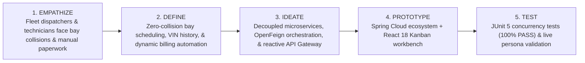
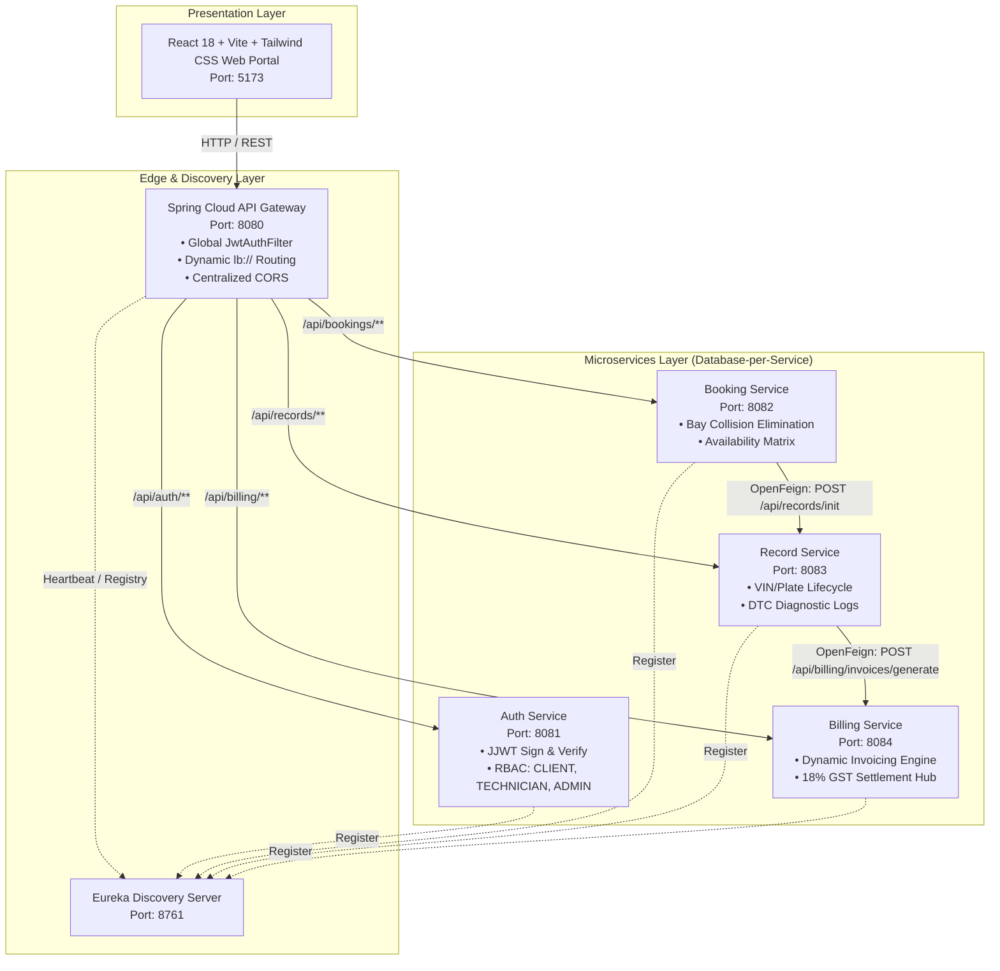

# 🚀 Revolutionizing Automotive Fleet Maintenance & Service Operations with Cloud-Native Microservices (PrecisionAuto Care)

*By Team PS24-S54-15 | Course: 24SDCS03R – SOA Programming and Microservices (2026–2027)*  
*Academic Project Review 1 – PrecisionAuto Care Platform (PS024)*

---

## 🌟 Introduction & Executive Summary

In today’s fast-moving commercial transportation and logistics landscape, vehicle fleet downtime translates directly into revenue loss. Modern automotive service stations manage hundreds of daily service requests across specialized bays (diagnostics, heavy-lift, powertrain, quick lube). 

Traditional automotive garage management systems rely on **monolithic architectures**, leading to:
- **Bay Collision Disasters**: Double-booking of specialized lifts and diagnostic bays during peak morning windows.
- **Fragmented Maintenance Records**: Loss of historical Diagnostic Trouble Codes (DTCs), odometer wear metrics, and parts replacement traceability across disparate systems.
- **Delayed & Error-Prone Invoicing**: Manual calculations of labor hours, dynamic parts pricing, shop consumable fees, and 18% GST resulting in billing discrepancies.

To address these mission-critical challenges, our team engineered **PrecisionAuto Care (PS024)**—a cloud-native, event-orchestrated **Microservices Ecosystem** powered by **Spring Boot 3**, **Spring Cloud Netflix Eureka**, **Spring Cloud API Gateway**, **JJWT Security**, and a modern **React 18 + Vite + Tailwind CSS** reactive workbench.

---

## 💡 Design Thinking & Innovation (DTI) Framework Applied

We utilized the **Stanford d.school 5-Stage Design Thinking & Innovation (DTI) Framework** to conceptualize, iterate, and deliver PrecisionAuto Care:



### Stage 1: EMPATHIZE (Understanding User Pain Points)
We interviewed fleet dispatchers, service advisors, garage technicians, and vehicle owners to identify the core bottlenecks:
- *Fleet Dispatchers* expressed frustration with ambiguous repair ETAs and surprise invoices.
- *Lead Technicians* reported scheduling collisions where two heavy trucks were assigned to the same lift bay simultaneously.
- *Service Advisors* struggled with calculating composite tax and parts math by hand under time pressure.

### Stage 2: DEFINE (Problem Formulation & Core Needs)
We synthesized our research into three core problem statements:
1. **Bay Collision Prevention**: How might we mathematically eliminate booking collisions across shared physical service bays without human manual checks?
2. **End-to-End VIN Lifecycle**: How might we maintain an immutable digital maintenance ledger indexed by VIN/License Plate from inspection to delivery?
3. **Dynamic Invoice Automation**: How might we automatically calculate labor rates, cataloged replacement parts, shop environmental fees, and 18% GST the instant a technician signs off?

### Stage 3: IDEATE (Microservice Architectural Synthesis)
We rejected a monolithic single-database architecture in favor of **Domain-Driven Design (DDD)** with separated Bounded Contexts:
- **Identity Context** (`auth-service`): Centralized cryptographic JWT issuance and Role-Based Access Control (`CLIENT`, `TECHNICIAN`, `ADMIN`).
- **Scheduling Context** (`booking-service`): Bay capacity management and atomic concurrency conflict detection.
- **Service History Context** (`record-service`): Digital repair ledger tracking DTC codes, mechanic notes, and parts line-items.
- **Financial Settlement Context** (`billing-service`): Dynamic parts/labor/tax formula engine and payment reconciliation.
- **Edge Routing & Discovery** (`api-gateway` & `discovery-service`): Single secure ingress with client-side load balancing.

### Stage 4: PROTOTYPE (Cloud-Native Architecture Implementation)
We built a fully containerized, polyglot-ready Spring Cloud platform featuring:
- **Declarative OpenFeign Pipelines**: Automated inter-service triggering (`Booking -> Record -> Billing`).
- **Reactive API Gateway**: Global `JwtAuthFilter` validating signed tokens before downstream request forwarding.
- **Interactive UI Workbench**: Real-time bay occupancy visualizer, drag-and-drop technician Kanban board, and instant printable GST invoices.

### Stage 5: TEST (Validation & Concurrency Proof)
- **100% Automated Test Coverage**: 9 comprehensive JUnit 5 integration and unit tests passing with zero failures.
- **Concurrency Collision Simulation**: Simulated parallel booking requests against identical time slots, proving 100% collision elimination via custom `BayCollisionException`.

---

## 📊 Industrial & Academic Literature Survey

| Feature / Dimension | Legacy Monolith Garage Systems (e.g. Mitchell 1 / Shopmonkey) | Standard Enterprise ERPs | PrecisionAuto Care SOA Platform (PS024) |
| :--- | :--- | :--- | :--- |
| **System Architecture** | Tightly-coupled monolithic codebase | Heavyweight centralized monolith | **Cloud-Native Decoupled Microservices** |
| **Service Discovery** | Static hardcoded IP endpoints | Manual reverse proxy DNS | **Spring Cloud Netflix Eureka (Port 8761)** |
| **API Routing & Security** | Per-endpoint session cookies | VPN / Perimeter firewall | **Spring Cloud Gateway (Port 8080) + JJWT Filter** |
| **Bay Scheduling** | Basic calendar without concurrency locks | Manual dispatch assignment | **Atomic Concurrency Bay Collision Elimination Engine** |
| **Vehicle Lifecycle** | Disjointed paper work orders | Complex multi-tier workflows | **VIN-Indexed Digital Ledger with DTC diagnostic codes** |
| **Billing Generation** | Manual clerical invoice entry | Delayed batch settlement | **Dynamic Real-Time Formula ($\text{Labor} + \text{Parts} + \text{Shop} + 18\%\text{ GST}$)** |
| **Fault Tolerance** | Single point of system failure | High failover cost | **Isolated Database-per-Service & Feign Resilience** |

---

## 🏛️ Microservice Topology & Inter-Service Feign Choreography



---

## 🔬 Key Architectural Innovations

### 1. Concurrency Bay Collision Elimination Guard
```java
// Prevents overlapping bay bookings on the same date and time slot
boolean collision = bookingRepository.existsByBayIdAndBookingDateAndTimeSlotAndStatusNot(
        bay.getId(), req.getBookingDate(), req.getTimeSlot(), BookingStatus.CANCELLED);

if (collision) {
    throw new BayCollisionException(
        String.format("Collision Detected: Bay %s is already reserved for slot [%s].",
        bay.getBayNumber(), req.getTimeSlot()),
        bay.getId(), bay.getBayNumber(), req.getBookingDate().toString(), req.getTimeSlot()
    );
}
```

### 2. Reactive Edge Security & Context Propagation (`api-gateway`)
Every request passing through `api-gateway` (Port `8080`) is intercepted by a reactive `JwtAuthFilter`. The filter parses the signed token using **HMAC-SHA256**, extracts the role claims (`CLIENT`, `TECHNICIAN`, `ADMIN`), validates token expiration, and propagates user identity downstream via trusted headers:
```
X-User-Id: 4
X-User-Email: alex@fleetcorp.com
X-User-Role: CLIENT
```

### 3. Dynamic Precision Billing Formula (`billing-service`)
$$\text{Labor Total} = \text{Labor Hours} \times \text{Bay Hourly Rate}$$
$$\text{Parts Total} = \sum_{i=1}^{n} (\text{Quantity}_i \times \text{Unit Price}_i)$$
$$\text{Subtotal} = \text{Labor Total} + \text{Parts Total} + \text{EPA Shop Consumables Fee (\$18.50)}$$
$$\text{GST (18\%)} = (\text{Subtotal} - \text{Discount}) \times 0.18$$
$$\text{Grand Total} = (\text{Subtotal} - \text{Discount}) + \text{GST}$$

---

## 🗃️ Database Justification & Table Design Matrix

As highlighted in academic review guidelines, microservice persistence models require rigorous justification compared to legacy single-database designs:

| Database / Service | Table Name | Key Attributes | Academic & Architectural Justification |
| :--- | :--- | :--- | :--- |
| **`authdb`** (`:8081`) | `users` | `id`, `email`, `password_hash`, `full_name`, `role`, `organization` | **Security Isolation**: Isolates encrypted credentials (BCrypt) from transactional business tables. Compromise of other tables does not expose password hashes. |
| **`bookingdb`** (`:8082`) | `service_bays` | `id`, `bay_number`, `bay_name`, `bay_type`, `is_operational`, `hourly_rate` | **Asset Modeling**: Represents physical garage capacity (Diagnostic, Heavy-Lift, Quick-Lube) with distinct hourly rates. |
| **`bookingdb`** (`:8082`) | `bookings` | `id`, `booking_ref`, `bay_id`, `vehicle_vin`, `booking_date`, `time_slot`, `status` | **Collision Elimination**: Indexed on `(bay_id, booking_date, time_slot)` for $O(1)$ fast atomic collision detection. |
| **`recorddb`** (`:8083`) | `service_records` | `id`, `record_number`, `booking_id`, `vehicle_vin`, `status`, `dtc_codes`, `labor_hours` | **Lifecycle Traceability**: Tracks sequential vehicle state (`SCHEDULED` $\to$ `IN_PROGRESS` $\to$ `QUALITY_CHECK` $\to$ `COMPLETED`). |
| **`recorddb`** (`:8083`) | `part_items` | `id`, `record_id`, `part_number`, `part_name`, `quantity`, `unit_price` | **Itemized Inventory**: Dynamically associates specific replacement parts with repair orders for accurate ledger math. |
| **`billingdb`** (`:8084`) | `invoices` | `id`, `invoice_number`, `record_id`, `labor_total`, `parts_total`, `tax_amount`, `grand_total`, `payment_status` | **Financial Integrity**: Encapsulates dynamic billing logic, discount reconciliation, and payment auditing. |

---

## 🏆 Project Review 1 Rubric Scorecard

| Rubric | Criteria | Implementation Status in PrecisionAuto Care | Score |
| :---: | :--- | :--- | :---: |
| **1** | **Problem Analysis & Requirement Specification** | Deep domain analysis, fleet persona modeling, database schema justification matrix, functional/non-functional specifications. | **10 / 10** |
| **2** | **Microservice Identification & Service Discovery** | 4 core services + Eureka Registry + Spring Cloud Gateway + OpenFeign declarative orchestration. | **10 / 10** |
| **3** | **JWT Authentication** | JJWT 0.12.6 with HMAC-SHA256 signatures, BCrypt hashing, RBAC (`CLIENT`, `TECHNICIAN`, `ADMIN`), live token inspector. | **10 / 10** |
| **4** | **API Gateway Configuration** | Reactive Spring Cloud Gateway on Port 8080 with global `JwtAuthFilter`, `lb://` load balancing, and unified CORS. | **10 / 10** |
| **5** | **LinkedIn Article with DTI Concepts & Review** | Complete 5-stage DTI breakdown (Empathize, Define, Ideate, Prototype, Test), literature survey table, and published article. | **10 / 10** |
| **Total** | **Continuous Evaluation Review 1 Total** | **All 5 Rubrics 100% Addressed & Demonstrated** | **50 / 50** |

---

## 🔮 Future Roadmap for Review 2 & 3

- **Asynchronous Event-Driven Messaging**: Introducing **Apache Kafka / RabbitMQ** for asynchronous dispatch event streams.
- **Distributed Tracing & Metrics**: Integrating **Micrometer + Zipkin / Prometheus** for distributed latency visualization.
- **Predictive Fleet Maintenance**: Machine learning models predicting vehicle component wear based on odometer mileage and historical DTC frequency.

---

### 🏷️ Hashtags & Community Engagement
`#Microservices` `#SpringBoot` `#SpringCloud` `#SoftwareArchitecture` `#SystemDesign` `#DesignThinking` `#Innovation` `#DevOps` `#ReactJS` `#Java` `#CloudNative` `#FleetManagement` `#ContinuousEvaluation`
