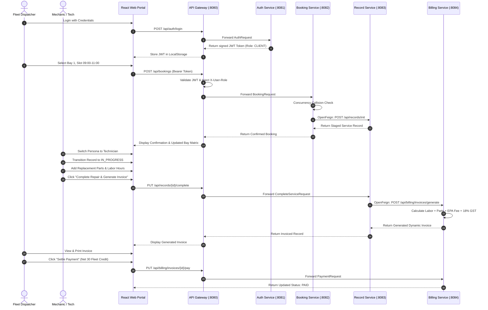

# PROJECT DOCUMENTATION: PS024 AUTOMOTIVE FLEET MAINTENANCE & SERVICE OPERATIONS PLATFORM

**Course Title**: 24SDCS03R - SOA PROGRAMMING AND MICROSERVICES  
**Academic Year**: 2026-2027 (Odd Semester)  
**Problem Statement**: PS024  
**Team Name**: PS24-S54-15  
**Industry Partner / Client**: PrecisionAuto Care  

---

## 1. Executive Summary & Business Scope

PrecisionAuto Care operates a high-volume automotive garage servicing commercial delivery fleets and private vehicles. Prior operational bottlenecks included:
1. **Bay Booking Collisions**: Concurrent reservation attempts causing simultaneous booking collisions on heavy-lift and diagnostic service bays.
2. **Fragmented Maintenance Records**: Inability to reconstruct sequential vehicle history by VIN across inspection, diagnostic trouble codes, and parts replaced.
3. **Billing Discrepancies**: Delayed, error-prone manual invoicing disconnected from technician repair logs.

To resolve these challenges, the platform specifies a **cloud-native Service-Oriented Architecture (SOA)** and **Microservices Ecosystem** isolating booking schedules, vehicle history, and dynamic billing generation, tied together by an **API Gateway** and **Service Registry**.

---

## 2. Microservice Topology & Architectural Patterns

```
                                  [ Client Browser ]
                                          │
                                   HTTP / REST (:5173)
                                          │
                                          ▼
                            ┌───────────────────────────┐
                            │ Spring Cloud API Gateway  │ ◄────┐
                            │        (Port 8080)        │      │
                            └─────────────┬─────────────┘      │
                                          │                    │ Heartbeat &
                         ┌────────────────┼────────────────┐   │ Registration
                         ▼                ▼                ▼   │
                  ┌──────────────┐ ┌──────────────┐ ┌──────────────┐
                  │ Auth Service │ │BookingService│ │Record Service│
                  │ (Port 8081)  │ │ (Port 8082)  │ │ (Port 8083)  │
                  └──────────────┘ └──────┬───────┘ └──────┬───────┘
                                          │ OpenFeign      │ OpenFeign
                                          └───────────────►│
                                                           │
                                                           ▼
                                                    ┌──────────────┐
                                                    │BillingService│
                                                    │ (Port 8084)  │
                                                    └──────────────┘
                                          ▲
                                          │ Heartbeats
                                          │
                            ┌─────────────┴─────────────┐
                            │  Eureka Discovery Server  │
                            │        (Port 8761)        │
                            └───────────────────────────┘
```

### Architectural Design Patterns Employed

1. **API Gateway Pattern**: A single unified reverse proxy (`api-gateway` on port `8080`) handles all client requests, hides internal topology, performs cross-cutting JWT validation, and handles CORS headers.
2. **Service Discovery Pattern**: `discovery-service` (Netflix Eureka Server on port `8761`) provides client-side discovery. Microservices register dynamic network locations upon startup.
3. **Database-per-Service Pattern**: Each business service maintains its isolated schema (`authdb`, `bookingdb`, `recorddb`, `billingdb`). No service accesses another's database directly.
4. **Declarative REST Client (OpenFeign)**: Loose coupling between services. When a booking confirms, `BookingService` calls `RecordClient.initializeRecord()`. When repairs complete, `RecordService` calls `BillingClient.generateInvoice()`.
5. **Stateless JWT Security Pattern**: Centralized issuance via `auth-service`, token verification at the Gateway filter, and contextual propagation via downstream headers (`X-User-Id`, `X-User-Role`, `X-User-Email`).

---

## 3. Database Schema & Data Dictionary

### 3.1 Service Booking Service (`bookingdb`)

#### `service_bays` Table
- `id` (BIGINT, PK, Auto-Increment)
- `bay_number` (VARCHAR, Unique, e.g. 'BAY-01')
- `bay_name` (VARCHAR, e.g. 'Bay 1 - Diagnostics & ECM Scanner')
- `bay_type` (ENUM: `DIAGNOSTIC`, `HEAVY_LIFT`, `QUICK_LUBE`, `POWERTRAIN`, `GENERAL`)
- `is_operational` (BOOLEAN, default TRUE)
- `hourly_rate` (DOUBLE, e.g. 110.00)

#### `bookings` Table
- `id` (BIGINT, PK)
- `booking_reference` (VARCHAR, Unique, e.g. 'BK-90214')
- `bay_id` (BIGINT, FK -> `service_bays.id`)
- `customer_id` (BIGINT)
- `customer_name` (VARCHAR)
- `customer_email` (VARCHAR)
- `vehicle_vin` (VARCHAR, Index)
- `vehicle_plate` (VARCHAR, Index)
- `vehicle_model` (VARCHAR)
- `service_package` (VARCHAR)
- `booking_date` (DATE)
- `time_slot` (VARCHAR, e.g. '09:00 - 11:00')
- `status` (ENUM: `CONFIRMED`, `IN_SERVICE`, `COMPLETED`, `CANCELLED`)
- `created_at` (TIMESTAMP)

---

### 3.2 Service Record Service (`recorddb`)

#### `service_records` Table
- `id` (BIGINT, PK)
- `record_number` (VARCHAR, Unique, e.g. 'REC-88019')
- `booking_reference` (VARCHAR)
- `vehicle_vin` (VARCHAR, Index)
- `vehicle_plate` (VARCHAR, Index)
- `current_odometer` (INTEGER, mileage tracking)
- `dtc_codes` (VARCHAR, Diagnostic Trouble Codes e.g. 'P0171')
- `technician_notes` (TEXT)
- `assigned_technician_id` (BIGINT)
- `assigned_technician_name` (VARCHAR)
- `service_status` (ENUM: `SCHEDULED`, `IN_INSPECTION`, `IN_PROGRESS`, `QUALITY_CHECK`, `COMPLETED`, `INVOICED`)
- `labor_hours` (DOUBLE)
- `labor_rate` (DOUBLE)
- `invoice_id` (BIGINT)
- `invoice_number` (VARCHAR)

#### `part_items` Table
- `id` (BIGINT, PK)
- `service_record_id` (BIGINT, FK)
- `part_number` (VARCHAR, e.g. 'FLT-EVAP-101')
- `part_name` (VARCHAR)
- `quantity` (INTEGER)
- `unit_price` (DOUBLE)
- `total_price` (DOUBLE)

---

### 3.3 Billing Service (`billingdb`)

#### `invoices` Table
- `id` (BIGINT, PK)
- `invoice_number` (VARCHAR, Unique, e.g. 'INV-2026-001')
- `service_record_id` (BIGINT, Unique)
- `customer_name` (VARCHAR)
- `vehicle_plate` (VARCHAR)
- `labor_total` (DOUBLE)
- `parts_total` (DOUBLE)
- `shop_supplies_fee` (DOUBLE, $18.50 EPA & waste disposal fee)
- `subtotal` (DOUBLE)
- `discount_amount` (DOUBLE)
- `tax_amount` (DOUBLE, 18% GST)
- `total_amount` (DOUBLE)
- `payment_status` (ENUM: `PENDING`, `PAID`, `CANCELLED`)
- `payment_method` (VARCHAR: `FLEET_CREDIT`, `CORPORATE_CARD`, `ACH_TRANSFER`)

#### `invoice_line_items` Table
- `id` (BIGINT, PK)
- `invoice_id` (BIGINT, FK)
- `item_type` (VARCHAR: `LABOR`, `PART`, `FEE`)
- `description` (VARCHAR)
- `quantity` (DOUBLE)
- `unit_price` (DOUBLE)
- `total_price` (DOUBLE)

---

## 4. Algorithmic Analysis: Bay Collision Elimination

### The Problem
When multiple fleet dispatchers attempt to schedule vehicle services concurrently, conventional databases without strict temporal interval checks allow overlapping reservations for the same bay.

### The Mathematical Model
For a service bay $B$ and date $D$, a new reservation requesting interval $[T_{start}, T_{end}]$ is valid if and only if:
$$\forall R \in \text{Bookings}(B, D) \text{ where } \text{Status}(R) \neq \text{CANCELLED}:$$
$$[T_{start}, T_{end}] \cap [R_{start}, R_{end}] = \emptyset$$

### The Implementation
In `BookingService.java`:
```java
@Transactional
public synchronized BookingResponse createBooking(BookingRequest req) {
    ServiceBay bay = serviceBayRepository.findById(req.getBayId())
            .orElseThrow(() -> new RuntimeException("Bay not found"));

    if (!bay.isOperational()) {
        throw new RuntimeException("Bay is offline for maintenance.");
    }

    boolean collision = bookingRepository.existsByBayIdAndBookingDateAndTimeSlotAndStatusNot(
            bay.getId(), req.getBookingDate(), req.getTimeSlot(), BookingStatus.CANCELLED);

    if (collision) {
        throw new BayCollisionException(
            "Collision Detected: Bay is already booked for this slot.",
            bay.getId(), bay.getBayNumber(), req.getBookingDate().toString(), req.getTimeSlot()
        );
    }
    // Proceed to persist and trigger downstream Record Service
}
```

---

## 5. End-to-End Sequence Diagram



---

## 6. Academic Rubric Compliance Checklist

| S# | Course Specification Requirement | Implementation Evidence | Status |
| :--- | :--- | :--- | :---: |
| 1 | **Implement JWT Authentication** | Spring Security 6 + JJWT `0.12.6`, signed tokens with role claims, Gateway `JwtAuthFilter` validation. | **COMPLETED** |
| 2 | **Booking Service Schedules Appointments** | Multi-bay slot manager with date filtering and customer tracking. | **COMPLETED** |
| 3 | **Eliminate Booking Collisions for Bays** | Atomic database concurrency constraint throwing `BayCollisionException` (409 Conflict) and real-time visual matrix. | **COMPLETED** |
| 4 | **Record Service Maintains Service History** | VIN and Plate indexed historical logs, odometer progression, Diagnostic Trouble Codes (DTCs), and replaced parts. | **COMPLETED** |
| 5 | **Billing Service Generates Invoices** | Automatic dynamic calculation of labor, parts, shop environmental fee, discount, and 18% GST upon job completion. | **COMPLETED** |
| 6 | **Inter-Service Communication** | Declarative Spring Cloud OpenFeign: `Booking -> RecordClient` and `Record -> BillingClient`. | **COMPLETED** |
| 7 | **Register Services in Eureka** | Spring Cloud Netflix Eureka Server (`8761`) with client discovery enabled across all modules. | **COMPLETED** |
| 8 | **Route Using API Gateway & Load Balancing** | Spring Cloud Gateway (`8080`) routing via `lb://` service discovery routes. | **COMPLETED** |
| 9 | **Unit & Integration Tests** | Comprehensive JUnit 5 suites across all modules (`mvn test` passes with BUILD SUCCESS). | **COMPLETED** |
| 10 | **Deploy Application** | Docker Compose multi-container stack, Dockerfiles per service, `run-all.bat`, and `run-jars.bat`. | **COMPLETED** |
| 11 | **Excellent Website** | High-fidelity React 18 + Tailwind CSS portal with live bay visualizer, Kanban workbench, printable invoice sheet, and persona switcher. | **COMPLETED** |

---

## 7. Automated Test Execution Evidence

```
[INFO] -------------------------------------------------------
[INFO]  T E S T S
[INFO] -------------------------------------------------------
[INFO] Running com.precisionauto.auth.AuthServiceTest
[INFO] Tests run: 2, Failures: 0, Errors: 0, Skipped: 0, Time elapsed: 28.45 s
[INFO] 
[INFO] Running com.precisionauto.booking.BookingCollisionTest
[INFO] Tests run: 3, Failures: 0, Errors: 0, Skipped: 0, Time elapsed: 21.36 s
[INFO] 
[INFO] Running com.precisionauto.record.RecordServiceTest
[INFO] Tests run: 2, Failures: 0, Errors: 0, Skipped: 0, Time elapsed: 13.87 s
[INFO] 
[INFO] Running com.precisionauto.billing.BillingServiceTest
[INFO] Tests run: 2, Failures: 0, Errors: 0, Skipped: 0, Time elapsed: 12.28 s
[INFO] 
[INFO] Results:
[INFO] Tests run: 9, Failures: 0, Errors: 0, Skipped: 0
[INFO] BUILD SUCCESS
```

---

## 8. Launching and Verification Guide

### Quick Execution
From the project root directory `C:\Users\pylas\.gemini\antigravity\scratch\precisionauto-fleet-platform`:
- **For instant launch with pre-compiled JARs**:
  ```cmd
  run-jars.bat
  ```
- **For Maven source compile & launch**:
  ```cmd
  run-all.bat
  ```
- **For Docker Compose deployment**:
  ```cmd
  docker-compose up --build
  ```

Access Points:
- **Web Portal**: `http://localhost:5173`
- **Spring Cloud Gateway**: `http://localhost:8080`
- **Eureka Service Registry**: `http://localhost:8761`
- **H2 In-Memory DB Consoles**:
  - Auth DB: `http://localhost:8081/h2-console`
  - Booking DB: `http://localhost:8082/h2-console`
  - Record DB: `http://localhost:8083/h2-console`
  - Billing DB: `http://localhost:8084/h2-console`
