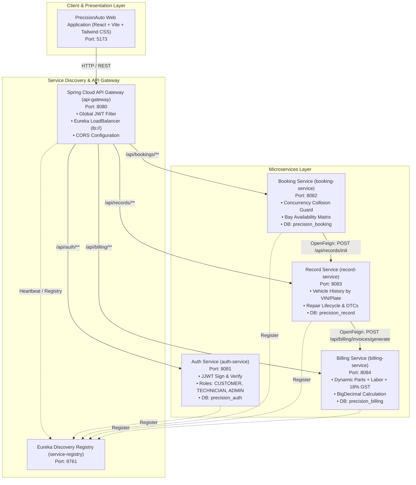

# PS024 – Automotive Fleet Maintenance & Service Operations Platform

**Company**: PrecisionAuto Care  
**Course**: 24SDCS03R – SOA PROGRAMMING AND MICROSERVICES  
**Academic Year**: 2026-2027 (Odd Semester)  
**Team**: PS24-S54-15  

---

## 📌 1. Project Purpose & Overview

PrecisionAuto Care is an enterprise digital garage management and fleet maintenance platform designed to replace manual pen-and-paper workshop workflows with a resilient, cloud-native **Microservices Architecture**.

### The Core Flow:
```text
Register / Login ➔ JWT ➔ Add Vehicle ➔ Book Service ➔ Prevent Collision ➔ Technician Updates Service ➔ Complete Service ➔ Save Service History ➔ Generate Invoice ➔ Customer Views & Settles Invoice
```

---

## 🏛️ 2. Microservices Architecture Topology



---

## 🛠️ 3. Technologies Used

- **Programming Language**: Java 17 / 21
- **Backend Framework**: Spring Boot 3.3.4
- **Microservices Stack**: Spring Cloud 2023.0.3 (Eureka Server, Spring Cloud Gateway, OpenFeign, LoadBalancer)
- **Security**: Spring Security 6, JJWT (Java JWT 0.12.6), BCrypt Password Encoder
- **Databases**: MySQL 8.0 (Docker/Production) / H2 in-memory (Local dev/testing)
- **Data Access & ORM**: Spring Data JPA / Hibernate
- **Frontend**: React 18, Vite, Tailwind CSS, Lucide Icons, Axios
- **Testing**: JUnit 5, Mockito, Spring Boot Test, WebTestClient
- **Containerization**: Docker, Docker Compose
- **API Documentation & Monitoring**: Swagger/OpenAPI, Spring Boot Actuator

---

## 📂 4. Project Folder Structure

```text
c:/Users/pylas/soapro/
├── discovery-service/        # Eureka Service Registry (Port 8761)
│   ├── src/main/java/com/precisionauto/discovery/
│   ├── Dockerfile
│   └── pom.xml
├── api-gateway/              # Spring Cloud API Gateway (Port 8080)
│   ├── src/main/java/com/precisionauto/gateway/
│   │   └── filter/JwtAuthFilter.java
│   ├── Dockerfile
│   └── pom.xml
├── auth-service/             # Authentication & User RBAC (Port 8081)
│   ├── src/main/java/com/precisionauto/auth/
│   │   ├── controller/AuthApiController.java
│   │   ├── entity/User.java
│   │   └── security/JwtService.java
│   ├── Dockerfile
│   └── pom.xml
├── booking-service/          # Bay Collision Prevention & Scheduling (Port 8082)
│   ├── src/main/java/com/precisionauto/booking/
│   │   ├── client/RecordServiceClient.java (OpenFeign)
│   │   ├── controller/BookingApiController.java
│   │   └── service/BookingService.java
│   ├── Dockerfile
│   └── pom.xml
├── record-service/           # Vehicle Service History & Telemetry (Port 8083)
│   ├── src/main/java/com/precisionauto/record/
│   │   ├── client/BillingServiceClient.java (OpenFeign)
│   │   ├── controller/RecordApiController.java
│   │   └── entity/ServiceRecord.java
│   ├── Dockerfile
│   └── pom.xml
├── billing-service/          # Dynamic Invoicing & 18% GST (Port 8084)
│   ├── src/main/java/com/precisionauto/billing/
│   │   ├── controller/BillingApiController.java
│   │   ├── entity/Invoice.java
│   │   └── service/BillingService.java
│   ├── Dockerfile
│   └── pom.xml
├── frontend/                 # React + Vite Client Application (Port 5173)
│   ├── src/
│   │   ├── components/       # LoginPage, Dashboard, Booking, Kanban, Billing, Arch, DTI
│   │   ├── services/api.js   # Centralized Axios API client
│   │   └── App.jsx
│   ├── Dockerfile
│   └── package.json
├── docker-compose.yml        # Full-stack Docker compose configuration
├── pom.xml                   # Root multi-module Maven parent POM
└── README.md
```

---

## 🗄️ 5. Database Setup

Each microservice maintains its own isolated database domain:
1. `precision_auth` – Users, BCrypt hashed passwords, roles (`CUSTOMER`, `TECHNICIAN`, `ADMIN`).
2. `precision_booking` – Service bays (Bays 1–4), customer appointments, collision timestamps.
3. `precision_record` – Service records, VIN telemetry, DTC trouble codes, technician notes, itemized parts.
4. `precision_billing` – Invoices, line items, BigDecimal totals, 18% GST, payment status (`PENDING`, `PAID`).

---

## 🛑 6. Booking Collision Prevention Engine

Service bays are treated as atomic physical resources.

### The Conflict Rule:
If **Bay 1** is reserved from `10:00 - 11:00`, another customer attempting to book **Bay 1** at `10:30 - 11:30` is rejected with **`409 Conflict`**.

### Backend Query Implementation:
```java
boolean collision = bookingRepository.existsByBayIdAndBookingDateAndTimeSlotAndStatusNot(
    bay.getId(), req.getBookingDate(), req.getTimeSlot(), BookingStatus.CANCELLED);

if (collision) {
    throw new BayCollisionException("Bay " + bay.getBayNumber() + " is already occupied for slot " + req.getTimeSlot());
}
```

---

## 🔐 7. JWT Authentication & Role-Based Access Control (RBAC)

1. Client posts credentials to `POST /api/auth/login`.
2. `Auth Service` verifies credentials via BCrypt and generates a cryptographic JJWT token containing role claims:
   ```json
   {
     "sub": "admin@precisionauto.com",
     "role": "ROLE_ADMIN",
     "name": "Robert Vance",
     "exp": 1789754600
   }
   ```
3. The client attaches `Authorization: Bearer <JWT_TOKEN>` on all subsequent requests.
4. `api-gateway` executes reactive `JwtAuthFilter` validating token authenticity before forwarding to downstream microservices.

---

## 📡 8. Required API Specifications

### Auth Endpoints (`:8081` / Gateway `:8080`)
- `POST /api/auth/register` – Register customer or technician account.
- `POST /api/auth/login` – Authenticate credentials and receive Bearer JWT.
- `GET /api/auth/me` – Retrieve current authenticated user profile.

### Booking Endpoints (`:8082` / Gateway `:8080`)
- `POST /api/bookings` – Create collision-safe booking.
- `GET /api/bookings` – List all workshop bookings.
- `GET /api/bookings/{id}` – Get booking details by ID.
- `PUT /api/bookings/{id}` – Update appointment time/bay.
- `DELETE /api/bookings/{id}` – Cancel reservation and free slot.
- `GET /api/bookings/customer/{customerId}` – Fetch customer's bookings.
- `GET /api/bookings/bays/availability` – Real-time matrix of Bays 1–4.
- `POST /api/bookings/{id}/confirm` – Mark booking confirmed.
- `POST /api/bookings/{id}/cancel` – Cancel and release bay slot.
- `POST /api/bookings/{id}/complete` – Complete and trigger record service.

### Record Endpoints (`:8083` / Gateway `:8080`)
- `POST /api/records` – Create initial service ticket.
- `GET /api/records` – List maintenance records.
- `GET /api/records/{id}` – Get record by ID.
- `PUT /api/records/{id}` – Update work performed, DTCs, parts used, labor.
- `GET /api/records/vin/{vin}` – Retrieve full vehicle history by VIN.
- `GET /api/records/customer/{customerId}` – Customer maintenance records.
- `POST /api/records/{id}/complete` – Complete service & trigger Billing via OpenFeign.

### Billing Endpoints (`:8084` / Gateway `:8080`)
- `POST /api/billing/invoices` – Create manual invoice.
- `GET /api/billing/invoices` – List all invoices.
- `GET /api/billing/invoices/{id}` – Get invoice by ID.
- `GET /api/billing/invoices/customer/{customerId}` – Customer invoices.
- `GET /api/billing/invoices/vehicle/{vehicleVin}` – Vehicle invoices.
- `POST /api/billing/invoices/generate/{recordId}` – Dynamically compute invoice.
- `POST /api/billing/invoices/{id}/pay` – Settle invoice (Net 30, Card, Wire).
- `POST /api/billing/invoices/{id}/cancel` – Cancel invoice.

---

## 🚀 9. How to Run the Application

### Option A: 1-Click Launch (Windows)
```cmd
run-all.bat
```
*(Or in PowerShell: `.\run-all.ps1`)*

---

### Option B: Docker Compose (All-in-One)
```bash
# Build all jars first
mvn clean package -DskipTests

# Start MySQL, Eureka, Gateway, Auth, Booking, Record, Billing, Frontend
docker-compose up --build
```

---

### Option C: Manual Spring Boot Launch
```bash
# 1. Start Eureka Registry (Port 8761)
cd discovery-service && mvn spring-boot:run

# 2. Start Auth Service (Port 8081)
cd ../auth-service && mvn spring-boot:run

# 3. Start Booking Service (Port 8082)
cd ../booking-service && mvn spring-boot:run

# 4. Start Record Service (Port 8083)
cd ../record-service && mvn spring-boot:run

# 5. Start Billing Service (Port 8084)
cd ../billing-service && mvn spring-boot:run

# 6. Start API Gateway (Port 8080)
cd ../api-gateway && mvn spring-boot:run

# 7. Start React Frontend (Port 5173)
cd ../frontend && npm run dev
```

---

## 🔑 10. Pre-Seeded Demonstration Accounts

| Role | Email | Password | Persona & Title |
| :--- | :--- | :--- | :--- |
| **Admin** | `admin@precisionauto.com` | `Admin@123` | Robert Vance (Garage Director) |
| **Technician** | `tech.john@precisionauto.com` | `Tech@123` | Johnathan Miller (Lead Tech) |
| **Technician** | `tech.sarah@precisionauto.com` | `Tech@123` | Sarah Jenkins (Senior Specialist) |
| **Customer** | `alex@fleetcorp.com` | `Client@123` | Alex Mercer (Fleet Dispatcher) |
| **Customer** | `maria@logistics.io` | `Client@123` | Maria Santos (Operations Mgr) |

*(Frontend includes 1-click quick persona selector pills for instant login without retyping).*

---

## 🧪 11. Automated Test Suite

Run the full test suite with Maven:
```bash
mvn test
```

### Verified Test Suites:
- `AuthServiceTest`: BCrypt password encoding, JWT token generation, role verification.
- `BookingCollisionTest`: Concurrency bay collision rejection, slot cancellation & release.
- `BillingServiceTest`: BigDecimal invoice aggregation, 18% GST, payment status transitions.
- `RecordServiceTest`: VIN indexing, DTC logging, OpenFeign service triggers.

---

## 🌟 12. Complete Demo Scenario

1. **Login**: Go to `http://localhost:5173/#login` $\rightarrow$ Select **Admin** or **Customer**.
2. **Book Service**: Schedule `AP-39-AB-1234` for **Bay 1 @ 10:00 AM**.
3. **Collision Test**: Attempt another booking for **Bay 1 @ 10:00 AM** $\rightarrow$ Notice immediate **409 Conflict** prevention.
4. **Service & Telemetry**: In Technician Kanban, start inspection, add DTC codes, and add replacement parts.
5. **Dynamic Invoice**: Marking service completed automatically generates invoice `INV-2026-XXXX` with **18% GST**.
6. **Settlement**: Settle invoice and print the PDF preview.
